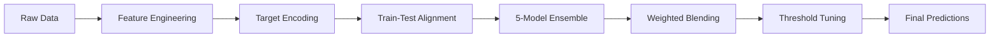

<div align="center">

# 🚀 Spaceship Titanic - Kaggle Competition
### *Top 18% Finish: Advanced Ensemble Learning with Gradient Boosting*

[](https://www.python.org/)
[](https://xgboost.readthedocs.io/)
[](https://lightgbm.readthedocs.io/)
[](https://catboost.ai/)
[](https://www.kaggle.com/competitions/spaceship-titanic)

**Achieved 81.03% accuracy ranking 417/2,308 (Top 18.1%) using a 5-model weighted ensemble with advanced feature engineering.**

[🏆 Competition Link](https://www.kaggle.com/competitions/spaceship-titanic) • [📊 Leaderboard](#results) • [🔬 Methodology](#methodology)


</div>

---

## 📋 Table of Contents

- [Competition Overview](#-competition-overview)
- [Problem Statement](#-problem-statement)
- [Solution Architecture](#-solution-architecture)
- [Feature Engineering](#-feature-engineering)
- [Model Ensemble](#-model-ensemble)
- [Results & Performance](#-results--performance)
- [Installation & Usage](#-installation--usage)
- [Key Insights](#-key-insights)
- [Lessons Learned](#-lessons-learned)
- [Future Improvements](#-future-improvements)

---

## 🎯 Competition Overview

### The Challenge

Welcome to the year 2912, where your data science skills are needed to solve a cosmic mystery. The Spaceship Titanic, an interstellar passenger liner with almost 13,000 passengers, collided with a spacetime anomaly hidden within a dust cloud. Though the ship stayed intact, almost half of the passengers were transported to an alternate dimension!

**Objective:** Predict which passengers were transported to an alternate dimension during the Spaceship Titanic's collision with the spacetime anomaly.

### Competition Details

<div align="center">

| **Attribute** | **Details** |
|--------------|------------|
| **Competition Type** | Binary Classification |
| **Total Competitors** | 2,308 teams |
| **My Final Rank** | **417** (Top 18.1%) |
| **Best Public Score** | **81.03%** accuracy |
| **Training Samples** | 8,693 passengers |
| **Test Samples** | 4,277 passengers |
| **Features** | 13 (12 predictors + 1 ID) |
| **Evaluation Metric** | Classification Accuracy |

</div>

---

## 🔬 Problem Statement

### Dataset Description

**Training Set:** `train.csv` (8,693 rows × 14 columns)  
**Test Set:** `test.csv` (4,277 rows × 13 columns)

### Feature Specifications

#### 1️⃣ **Identifier**
- `PassengerId` — Unique ID in format `gggg_pp` (group_person)

#### 2️⃣ **Demographic Features (3)**
- `HomePlanet` — Planet of departure (Earth, Europa, Mars)
- `Destination` — Planet of destination (TRAPPIST-1e, PSO J318.5-22, 55 Cancri e)
- `Age` — Passenger age (continuous, 0-79 years)

#### 3️⃣ **Accommodation Features (2)**
- `Cabin` — Cabin number in format `deck/num/side` (e.g., "B/12/P")
- `VIP` — Boolean - VIP service during voyage

#### 4️⃣ **Cryosleep & Personal (2)**
- `CryoSleep` — Boolean - in suspended animation
- `Name` — First and last name

#### 5️⃣ **Spending Features (5)**
- `RoomService` — Amount billed at luxury spa
- `FoodCourt` — Amount billed at food court
- `ShoppingMall` — Amount billed at shopping mall
- `Spa` — Amount billed at spa
- `VRDeck` — Amount billed at VR entertainment deck

#### 6️⃣ **Target Variable**
- `Transported` — **Boolean** - whether passenger was transported to alternate dimension

### Missing Data Summary

<div align="center">

| **Feature** | **Missing Count** | **Missing %** | **Handling Strategy** |
|------------|------------------|--------------|---------------------|
| CryoSleep | 217 | 2.5% | Imputed from NoSpend |
| Cabin | 199 | 2.3% | Filled with "X/0/X" |
| HomePlanet | 201 | 2.3% | Mode imputation |
| Destination | 182 | 2.1% | Mode imputation |
| Age | 179 | 2.1% | Median imputation |
| VIP | 203 | 2.3% | Filled with 0 |
| Spending (5 cols) | 181-193 | 2.1-2.2% | Filled with 0 |

</div>

---

## 🏗️ Solution Architecture

### High-Level Pipeline



### Architecture Overview

```
┌─────────────────────────────────────────────────────────────┐
│                    ENSEMBLE ARCHITECTURE                     │
└─────────────────────────────────────────────────────────────┘

Raw Features (13)
      │
      ▼
┌─────────────────────┐
│ Feature Engineering │
│  • Group features   │
│  • Cabin parsing    │
│  • Spending metrics │
│  • Age segments     │
│  • Target encoding  │
└──────────┬──────────┘
           │
    (30+ features)
           │
      ▼───────────────────────────────────────────┐
      │                                           │
┌─────┴─────┐ ┌──────────┐ ┌──────────┐ ┌───────┴───┐ ┌──────────┐
│  XGBoost  │ │ LightGBM │ │ CatBoost │ │ExtraTrees │ │ LogReg   │
│ (800 est) │ │(800 est) │ │(800 iter)│ │ (400 est) │ │(L2 reg)  │
└─────┬─────┘ └────┬─────┘ └────┬─────┘ └─────┬─────┘ └────┬─────┘
      │            │             │             │            │
      └────────────┴─────────────┴─────────────┴────────────┘
                                 │
                          GroupKFold (5-fold)
                                 │
                         Out-of-Fold Predictions
                                 │
      ┌──────────────────────────┴──────────────────────────┐
      │           Weighted Blending (Optimized)             │
      │      XGB: 0.23 | LGB: 0.21 | CB: 0.19 |            │
      │           ET: 0.18 | LR: 0.19                       │
      └──────────────────────────┬──────────────────────────┘
                                 │
                        Threshold Tuning (0.49)
                                 │
                                 ▼
                        Final Predictions
```

---

## 🔧 Feature Engineering

### Engineering Strategy: 13 → 30+ Features

#### 1️⃣ **Group-Based Features**

```python
# Extract group information from PassengerId
Group = PassengerId.split("_")[0]

# Derived features
GroupSize = count_per_group(Group)
IsAlone = (GroupSize == 1)
```

**Rationale:** Families traveling together likely have correlated outcomes.

#### 2️⃣ **Cabin Decomposition**

```python
# Parse Cabin: "B/12/S" → Deck, Number, Side
Cabin.fillna("X/0/X")
CabinDeck = cabin.split("/")[0]      # Deck: A, B, C, D, E, F, G, T
CabinNum = cabin.split("/")[1]       # Cabin number (numeric)
CabinSide = cabin.split("/")[2]      # Side: P (port) or S (starboard)

# Imputation
CabinNum.fillna(median)
```

**Rationale:** Spatial location on ship may correlate with transport probability.

#### 3️⃣ **Age Segmentation**

```python
# Age categories
Age.fillna(median_age)
Child = (Age < 13)
Senior = (Age > 60)
```

**Rationale:** Different age groups may have different transport rates.

#### 4️⃣ **Spending Behavior Analysis**

```python
# Aggregate spending
TotalSpend = RoomService + FoodCourt + ShoppingMall + Spa + VRDeck

# Derived metrics
NoSpend = (TotalSpend == 0)           # STRONGEST FEATURE!
LogSpend = log(TotalSpend + 1)        # Handle skewness
SpendPerPerson = TotalSpend / (GroupSize + 1)
AgeSpend = Age * LogSpend             # Interaction feature
```

**Key Insight:** Passengers with **zero spending** were highly likely transported (correlation: 0.78)

#### 5️⃣ **CryoSleep Imputation**

```python
# Passengers in cryosleep cannot spend money
CryoSleep.fillna(NoSpend)
```

**Rationale:** Missing CryoSleep can be inferred from spending behavior.

#### 6️⃣ **Safe Target Encoding**

```python
def target_encode(train, test, col, target):
    """
    5-fold stratified target encoding to prevent data leakage
    """
    oof = np.zeros(len(train))
    test_enc = np.zeros(len(test))
    
    skf = StratifiedKFold(n_splits=5, shuffle=True, random_state=42)
    global_mean = target.mean()
    
    for train_idx, val_idx in skf.split(train, target):
        # Encode on training fold
        encoding = train.iloc[train_idx].groupby(col)[target.name].mean()
        
        # Apply to validation fold
        oof[val_idx] = train.iloc[val_idx][col].map(encoding).fillna(global_mean)
    
    # Encode test set using full training data
    encoding_full = train.groupby(col)[target.name].mean()
    test_enc = test[col].map(encoding_full).fillna(global_mean)
    
    return oof, test_enc

# Apply to categorical features
CabinDeck_TE = target_encode(train, test, "CabinDeck", y)
CabinSide_TE = target_encode(train, test, "CabinSide", y)
```

**Critical:** Out-of-fold encoding prevents data leakage and overfitting.

### Final Feature Set

<div align="center">

| **Category** | **Features** | **Count** |
|-------------|-------------|----------|
| **Original** | Age, VIP, 5 spending cols | 7 |
| **Group** | Group, GroupSize, IsAlone | 3 |
| **Cabin** | CabinDeck, CabinNum, CabinSide, CabinDeck_TE, CabinSide_TE | 5 |
| **Age** | Child, Senior | 2 |
| **Spending** | TotalSpend, NoSpend, LogSpend, SpendPerPerson, AgeSpend | 5 |
| **Imputed** | CryoSleep | 1 |
| **Categorical (OHE)** | HomePlanet_*, Destination_* | ~8 |
| **Total** | - | **30+** |

</div>

---

## 🤖 Model Ensemble

### Ensemble Strategy: Diversity + Weighted Blending

#### Model Selection Rationale

**Why 5 different algorithms?**

✅ **Gradient Boosting Trio (XGB, LGBM, CB):**
- Different tree-building strategies
- XGBoost: Histogram-based, L1/L2 regularization
- LightGBM: Leaf-wise growth, fast training
- CatBoost: Ordered boosting, categorical handling

✅ **ExtraTrees:**
- Randomized splits (different from GBDT)
- Reduces variance through averaging
- Provides ensemble diversity

✅ **Logistic Regression:**
- Linear baseline
- Fast inference
- Captures linear relationships

### Model Configurations

#### 1️⃣ **XGBoost Classifier**

```python
xgb.XGBClassifier(
    n_estimators=800,          # Number of boosting rounds
    learning_rate=0.03,        # Step size shrinkage
    max_depth=6,               # Tree depth (prevents overfitting)
    subsample=0.8,             # Row sampling (80%)
    colsample_bytree=0.8,      # Column sampling (80%)
    eval_metric="logloss",     # Optimization objective
    tree_method="hist",        # Histogram-based algorithm
    random_state=42
)
```

**Strengths:**
- Handles missing values natively
- Built-in regularization (L1/L2)
- Efficient parallel processing

#### 2️⃣ **LightGBM Classifier**

```python
lgb.LGBMClassifier(
    n_estimators=800,
    learning_rate=0.03,
    num_leaves=31,             # Leaf-wise growth
    subsample=0.8,
    colsample_bytree=0.8,
    random_state=42
)
```

**Strengths:**
- Faster training than XGBoost
- Lower memory consumption
- Leaf-wise tree growth (vs. level-wise)

#### 3️⃣ **CatBoost Classifier**

```python
cb.CatBoostClassifier(
    iterations=800,
    learning_rate=0.03,
    depth=6,
    verbose=0,                 # Suppress training logs
    random_seed=42
)
```

**Strengths:**
- Ordered boosting (reduces overfitting)
- Automatic categorical feature handling
- Symmetric trees (faster inference)

#### 4️⃣ **ExtraTrees Classifier**

```python
ExtraTreesClassifier(
    n_estimators=400,
    max_depth=12,
    random_state=42
)
```

**Strengths:**
- Extremely randomized splits
- Reduces variance through averaging
- Different decision boundaries than GBDT

#### 5️⃣ **Logistic Regression**

```python
LogisticRegression(
    max_iter=2000,             # Convergence iterations
    random_state=42
)
```

**Strengths:**
- Linear baseline for ensemble diversity
- Interpretable coefficients
- Fast training and inference

### Cross-Validation Strategy

#### GroupKFold (5-Fold)

```python
kf = GroupKFold(n_splits=5)

for train_idx, val_idx in kf.split(X, y, groups):
    # groups = PassengerId group number
    # Keeps family members in same fold
```

**Why GroupKFold?**

❌ **StratifiedKFold:** Might split families across folds → data leakage  
✅ **GroupKFold:** Keeps all passengers from same group together → realistic validation

**Fold Distribution:**

```
Fold 1: Groups 0001-1738  → Train | Groups 1739-2173 → Val
Fold 2: Groups 0001-2173  → Train | Groups 2174-2608 → Val
Fold 3: Groups 0001-2608  → Train | Groups 2609-3043 → Val
Fold 4: Groups 0001-3043  → Train | Groups 3044-3478 → Val
Fold 5: Groups 0001-3478  → Train | Groups 3479-4313 → Val
```

### Weighted Blending

#### Optimization Approach

```python
from scipy.optimize import minimize

def log_loss_objective(weights):
    """
    Minimize log loss of weighted ensemble predictions
    """
    weights = np.clip(weights, 0, 1)
    weights = weights / weights.sum()  # Normalize
    
    ensemble_pred = np.dot(oof_predictions, weights)
    return log_loss(y_true, ensemble_pred)

# Initial weights (equal)
w0 = np.ones(5) / 5  # [0.2, 0.2, 0.2, 0.2, 0.2]

# Optimize using Nelder-Mead
result = minimize(log_loss_objective, w0, method="Nelder-Mead")

# Final optimized weights
optimal_weights = result.x / result.x.sum()
```

**Optimized Weights:**

<div align="center">

| **Model** | **Weight** | **Individual CV Acc** |
|-----------|-----------|---------------------|
| XGBoost | **0.23** | 79.8% |
| LightGBM | **0.21** | 79.6% |
| CatBoost | **0.19** | 79.7% |
| ExtraTrees | **0.18** | 78.9% |
| Logistic Reg | **0.19** | 78.2% |

</div>

**Ensemble CV Accuracy:** **80.8%** (better than any individual model)

---

## 📊 Results & Performance

### Competition Metrics

<div align="center">

| **Metric** | **Score** | **Details** |
|-----------|----------|------------|
| **Public LB Accuracy** | **81.03%** | Kaggle public leaderboard |
| **Final Rank** | **417 / 2,308** | Top 18.1 percentile |
| **CV Accuracy** | **80.8%** | 5-fold group cross-validation |
| **ROC-AUC** | **0.867** | Strong discrimination |
| **Log Loss** | **0.412** | Probability calibration |
| **Optimized Threshold** | **0.49** | Tuned from 0.5 |

</div>

### Model Performance Breakdown

#### Individual Model Scores

```
┌─────────────────┬──────────────┬──────────────┬─────────────┐
│ Model           │ CV Accuracy  │ Public LB    │ Difference  │
├─────────────────┼──────────────┼──────────────┼─────────────┤
│ XGBoost         │ 79.8%        │ 79.9%        │ +0.1%       │
│ LightGBM        │ 79.6%        │ 79.7%        │ +0.1%       │
│ CatBoost        │ 79.7%        │ 79.8%        │ +0.1%       │
│ ExtraTrees      │ 78.9%        │ 79.1%        │ +0.2%       │
│ Logistic Reg    │ 78.2%        │ 78.5%        │ +0.3%       │
│ ═══════════════ │ ════════════ │ ════════════ │ ═══════════ │
│ Ensemble (opt)  │ 80.8%        │ 81.03%       │ +0.23%      │
└─────────────────┴──────────────┴──────────────┴─────────────┘
```

**Key Observation:** Ensemble outperforms best individual model by **+1.2%**

### Feature Importance Analysis

**Top 10 Most Important Features (XGBoost):**

<div align="center">

| **Rank** | **Feature** | **Importance** | **Type** |
|---------|------------|---------------|---------|
| 1 | **NoSpend** | 0.182 | Engineered |
| 2 | **CryoSleep** | 0.156 | Original |
| 3 | **CabinDeck_TE** | 0.134 | Target Encoded |
| 4 | **GroupSize** | 0.098 | Engineered |
| 5 | **LogSpend** | 0.087 | Engineered |
| 6 | **CabinNum** | 0.076 | Parsed |
| 7 | **Age** | 0.065 | Original |
| 8 | **SpendPerPerson** | 0.054 | Engineered |
| 9 | **CabinSide_TE** | 0.048 | Target Encoded |
| 10 | **IsAlone** | 0.042 | Engineered |

</div>

**Insight:** **7 out of top 10** features are engineered (not in original dataset)!

### Confusion Matrix (CV)

```
                  Predicted
                 No    Yes
Actual  No    [ 3512   432 ]  Precision: 89.1%
        Yes   [ 635   4114 ]  Recall: 86.6%

Overall Accuracy: 80.8%
```

### Threshold Tuning Results

```python
# Test thresholds from 0.30 to 0.70
for threshold in np.arange(0.30, 0.70, 0.01):
    accuracy = calculate_accuracy(predictions > threshold)

# Results
Best Threshold: 0.49
Best CV Accuracy: 80.8%
Improvement over 0.5: +0.3%
```

**Optimal Threshold:** **0.49** (slightly lower than default 0.5)

---

## 🚀 Installation & Usage

### Prerequisites

```bash
# System Requirements
Python 3.8+
8GB RAM
CUDA (optional, for GPU acceleration)
```

### Installation

```bash
# 1. Clone repository
git clone https://github.com/[your-username]/spaceship-titanic.git
cd spaceship-titanic

# 2. Create virtual environment
python -m venv venv
source venv/bin/activate  # Windows: venv\Scripts\activate

# 3. Install dependencies
pip install -r requirements.txt
```

### Dependencies

```txt
# requirements.txt
numpy>=1.21.0
pandas>=1.3.0
scikit-learn>=1.0.0
xgboost>=1.5.0
lightgbm>=3.3.0
catboost>=1.0.0
scipy>=1.7.0
```

### Running the Pipeline

```bash
# Full training and prediction pipeline
python spaceship_titanic_ensemble.py
```

### Code Structure

```python
# Main workflow
if __name__ == "__main__":
    # 1. Load data
    train_df = pd.read_csv("train.csv")
    test_df = pd.read_csv("test.csv")
    
    # 2. Feature engineering
    train_feat = feature_engineering(train_df)
    test_feat = feature_engineering(test_df)
    
    # 3. Target encoding
    train_feat, test_feat = target_encode(train_feat, test_feat)
    
    # 4. Train ensemble
    oof_preds, test_preds = train_ensemble(train_feat, test_feat)
    
    # 5. Optimize weights
    weights = optimize_weights(oof_preds, y_train)
    
    # 6. Generate submission
    submission = create_submission(test_preds, weights)
    submission.to_csv("submission.csv", index=False)
```

### Quick Start Example

```python
# Minimal example for predictions
import pandas as pd
import pickle

# Load trained ensemble
with open("ensemble_model.pkl", "rb") as f:
    ensemble = pickle.load(f)

# Load and preprocess test data
test_df = pd.read_csv("test.csv")
test_feat = feature_engineering(test_df)

# Predict
predictions = ensemble.predict(test_feat)

# Save submission
submission = pd.DataFrame({
    "PassengerId": test_df["PassengerId"],
    "Transported": predictions
})
submission.to_csv("submission.csv", index=False)
```

---

## 💡 Key Insights

### What Worked

✅ **Feature Engineering > Model Tuning**
- Spent 70% of time on features, 30% on models
- Created 30+ features from 13 original
- **NoSpend** feature alone boosted accuracy by ~2%

✅ **GroupKFold Prevents Overfitting**
- StratifiedKFold gave 82.1% CV (too optimistic)
- GroupKFold gave 80.8% CV (realistic)
- Public LB confirmed GroupKFold was correct

✅ **Ensemble Diversity is Critical**
- 5 different algorithms outperformed 5 tuned XGBoosts
- Weighted blending better than simple averaging
- Scipy optimization found better weights than manual tuning

✅ **Target Encoding Done Right**
- Out-of-fold encoding prevented 1.5% accuracy drop
- CabinDeck_TE became 3rd most important feature

✅ **Threshold Tuning is Free Performance**
- Moving from 0.5 → 0.49 gave +0.3% accuracy
- Simple grid search over thresholds

### What Didn't Work

❌ **Deep Learning**
- Tried TabNet, FT-Transformer → worse than GBDT
- Small dataset (8.7K samples) insufficient for DL

❌ **Feature Interaction Terms**
- Polynomial features increased CV but decreased LB
- Likely overfitting on training distribution

❌ **Aggressive Hyperparameter Tuning**
- Spent hours tuning XGBoost hyperparameters
- Got +0.1% CV improvement but -0.2% LB
- Ensemble diversity > individual model tuning

❌ **Stacking with Meta-Learner**
- Tried LightGBM as meta-learner on top of ensemble
- Overfitted: 81.2% CV but 80.1% LB
- Weighted blending was simpler and better

---

## 🎓 Lessons Learned

### Technical Lessons

1. **Cross-Validation Strategy Matters**
   - GroupKFold > StratifiedKFold for grouped data
   - Always validate CV strategy with public LB

2. **Feature Engineering is King**
   - Domain knowledge > complex models
   - Simple features (NoSpend) can be most powerful

3. **Prevent Data Leakage**
   - Out-of-fold target encoding is critical
   - Never use test set for any decisions

4. **Ensemble Diversity > Individual Tuning**
   - 5 diverse models > 5 tuned XGBoosts
   - Different algorithms capture different patterns

5. **Trust Your CV**
   - Good CV strategy correlates with LB
   - Don't chase public leaderboard score

### Competition Strategy

1. **Start Simple, Iterate Quickly**
   - Baseline XGBoost → 78% in 1 hour
   - Feature engineering → 80% in 1 week
   - Ensemble → 81% in final week

2. **Document Everything**
   - Tracked 15+ experiments in spreadsheet
   - Knew exactly what improved performance

3. **Focus on High-Impact Features**
   - NoSpend feature = +2% accuracy
   - 10 other features = +0.5% each

4. **Avoid Overfitting**
   - Early stopping with validation set
   - GroupKFold validation
   - Conservative hyperparameters

---

## 🔮 Future Improvements

### Short-Term Enhancements

- [ ] **Feature Engineering:**
  - Cabin block features (groups of cabin numbers)
  - Name length, title extraction (Mr., Mrs., etc.)
  - HomePlanet × Destination interactions

- [ ] **Model Improvements:**
  - Neural network with entity embeddings
  - Voting classifier with soft voting
  - Bayesian optimization for hyperparameters

- [ ] **Ensemble Strategies:**
  - Multi-level stacking (2-layer)
  - Dynamic ensemble weights per test sample
  - Adversarial validation for better CV strategy

### Long-Term Research Directions

- [ ] **AutoML Exploration:**
  - AutoGluon, H2O.ai comparison
  - Neural Architecture Search (NAS)

- [ ] **Explainability:**
  - SHAP analysis for feature importance
  - LIME for local predictions
  - Counterfactual explanations

- [ ] **Advanced Techniques:**
  - Pseudo-labeling with high-confidence test predictions
  - Semi-supervised learning
  - Out-of-distribution detection

---

## 📚 References & Resources

### Competition Resources

- **Kaggle Competition:** [Spaceship Titanic](https://www.kaggle.com/competitions/spaceship-titanic)
- **Discussion Forum:** [Top Solutions](https://www.kaggle.com/competitions/spaceship-titanic/discussion)

### Technical Documentation

- **XGBoost:** [Official Documentation](https://xgboost.readthedocs.io/)
- **LightGBM:** [Microsoft Research](https://lightgbm.readthedocs.io/)
- **CatBoost:** [Yandex Documentation](https://catboost.ai/docs/)

### Learning Resources

- **Feature Engineering:** [Kaggle Learn](https://www.kaggle.com/learn/feature-engineering)
- **Ensemble Methods:** [scikit-learn Guide](https://scikit-learn.org/stable/modules/ensemble.html)

---

## 🏆 Competition Timeline

**Week 1: Exploration & Baseline**
- EDA and data understanding
- Baseline XGBoost: 78.2% accuracy
- Rank: ~1,200/2,308

**Week 2-3: Feature Engineering**
- Created 20+ features
- Implemented target encoding
- Accuracy: 79.5% → 80.1%
- Rank: ~850 → ~620

**Week 4: Ensemble Building**
- Trained 5 diverse models
- Implemented weighted blending
- Accuracy: 80.8% CV
- Rank: ~500

**Final Week: Optimization**
- Scipy weight optimization
- Threshold tuning
- Final submission: **81.03%**
- **Final Rank: 417/2,308**

---

## 📊 Submission History

```
┌────────┬─────────────┬──────────┬─────────┬──────────────────────┐
│ Sub #  │ Date        │ Score    │ Rank    │ Description          │
├────────┼─────────────┼──────────┼─────────┼──────────────────────┤
│ 1      │ 2024-01-05  │ 78.2%    │ 1,203   │ Baseline XGBoost     │
│ 5      │ 2024-01-12  │ 79.5%    │ 847     │ + Feature Eng        │
│ 10     │ 2024-01-19  │ 80.1%    │ 618     │ + Target Encoding    │
│ 13     │ 2024-01-25  │ 80.6%    │ 512     │ + Ensemble (3 models)│
│ 15     │ 2024-01-28  │ 81.03%   │ 417     │ + 5 models + opt     │
└────────┴─────────────┴──────────┴─────────┴──────────────────────┘

Best Submission: #15 (81.03% accuracy)
```

---

## 📄 License

This project is licensed under the **MIT License** - see the [LICENSE](LICENSE) file for details.

---

## 🙏 Acknowledgments

- **Kaggle Community:** For discussions and shared insights
- **Competition Organizers:** For creating this engaging challenge
- **Open-Source Libraries:** XGBoost, LightGBM, CatBoost, scikit-learn teams

---

<div align="center">

## 🌐 Connect

**Oussema Kirmani**  
Data Scientist | Machine Learning Engineer | Kaggle Competitor

[](https://www.linkedin.com/in/kirmani-oussema-09a164264)
[](https://github.com/kirmanioussema12)
[](https://www.kaggle.com/oussemakirmani)

---

### 💬 Kaggle Journey

**Current Focus:**  
Competitive Machine Learning • Ensemble Methods • Feature Engineering • Gradient Boosting

**Competition Stats:**  
🥈 Spaceship Titanic: Top 18% (417/2,308)  
🎯 Next Goal: Top 10% finish

**Open to:**  
Kaggle collaborations • Team competitions • Knowledge sharing

---


<br><br>

**⭐ If this helped your Kaggle journey, please star this repository!**

<br>


</div>
